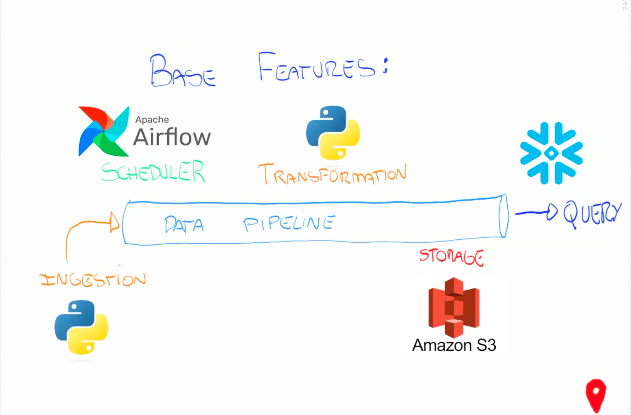

# Data Engineering Beginner Project

This project, created by Data Engineering Explorers, aims to create infrastrucutre and pipeline for the following design.

.

## Steps

To create this project, a video in our [channel](https://www.youtube.com/@DataEngineeringExplorers) was released.

It follows the following steps:

- create bucket in s3

  - [create access key](https://docs.aws.amazon.com/powershell/latest/userguide/pstools-appendix-sign-up.html)
  - give access to user to write in bucket

- setup env for airflow

  - [install docker desktop / docker](https://docs.docker.com/engine/install/)
  - [deploy application locally in containers](ttps://airflow.apache.org/docs/apache-airflow/stable/howto/docker-compose/index.html)

- create code in jupyter (create environment and install dependencies)

- create dag using [tasks](https://airflow.apache.org/docs/apache-airflow/stable/core-concepts/tasks.html)

  - change [dockerfile](https://docs.docker.com/engine/reference/commandline/build/) to encompass dependency to write in s3
  - re-deploy application locally in containers - ok

- test dag

- connect s3 data to [snowflake](https://docs.snowflake.com/en/user-guide/data-load-s3-compatible-storage)

Reminder: don't forget to insert your AWS credentials in **aiflow/dags/.env** for the code to work.
